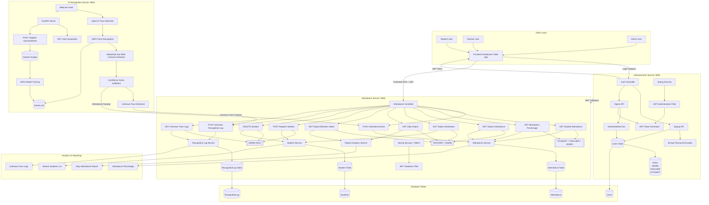

# Complete Detailed System Architecture

```mermaid id="deeparchitecture01"
flowchart TB

%% =====================================================
%% CLIENT LAYER
%% =====================================================

subgraph CLIENT_LAYER [Client Layer]

    STUDENT[Student User]
    TEACHER[Teacher User]
    ADMIN[Admin User]

    FRONTEND[Frontend Dashboard / Web App]

    STUDENT --> FRONTEND
    TEACHER --> FRONTEND
    ADMIN --> FRONTEND

end

%% =====================================================
%% AUTHENTICATION SERVICE
%% =====================================================

subgraph AUTH_SERVICE [Authentication Service :8081]

    AUTH_CONTROLLER[Auth Controller]

    SIGNUP[Signup API]

    SIGNIN[Signin API]

    JWT_GENERATOR[JWT Token Generator]

    JWT_FILTER[JWT Authentication Filter]

    USER_DETAILS[UserDetailsService]

    PASSWORD_ENCODER[BCrypt Password Encoder]

    SPRING_SECURITY[Spring Security]

    AUTH_DB[(Users Table)]

    ROLE_ENUM[(Roles<br/>ADMIN<br/>TEACHER<br/>STUDENT)]

    AUTH_CONTROLLER --> SIGNUP

    AUTH_CONTROLLER --> SIGNIN

    SIGNUP --> PASSWORD_ENCODER

    SIGNUP --> AUTH_DB

    SIGNIN --> USER_DETAILS

    USER_DETAILS --> AUTH_DB

    SIGNIN --> JWT_GENERATOR

    JWT_FILTER --> JWT_GENERATOR

    SPRING_SECURITY --> JWT_FILTER

    AUTH_DB --> ROLE_ENUM

end

%% =====================================================
%% ATTENDANCE SERVICE
%% =====================================================

subgraph ATTENDANCE_SERVICE [Attendance Service :8082]

    ATT_CONTROLLER[Attendance Controller]

    ATT_SERVICE[Attendance Service]

    STUDENT_SERVICE[Student Service]

    REPORT_SERVICE[Report Analytics Service]

    LOG_SERVICE[Recognition Log Service]

    JWT_VALIDATION[JWT Validation Filter]

    ATT_SECURITY[Spring Security + RBAC]

    %% ===============================
    %% Attendance APIs
    %% ===============================

    MARK_ATT[POST /attendance/mark]

    GET_ATT[GET Student Attendance]

    GET_PERCENT[GET Attendance Percentage]

    TODAY_ATT[GET Today's Attendance]

    ABSENT_API[GET Today's Absentees]

    REPORT_TODAY[GET Daily Report]

    REPORT_BETWEEN[GET Report Between Dates]

    %% ===============================
    %% Student APIs
    %% ===============================

    REGISTER_STUDENT[POST Register Student]

    DELETE_STUDENT[DELETE Student]

    %% ===============================
    %% Recognition APIs
    %% ===============================

    UNKNOWN_LOG[POST Unknown Recognition Log]

    GET_UNKNOWN[GET Unknown Face Logs]

    %% ===============================
    %% Role Restrictions
    %% ===============================

    ADMIN_ROLE[[ADMIN ONLY]]

    TEACHER_ROLE[[TEACHER + ADMIN]]

    STUDENT_ROLE[[STUDENT + TEACHER + ADMIN]]

    %% ===============================
    %% Database Layer
    %% ===============================

    ATT_DB[(Attendance Table)]

    STUDENT_DB[(Student Table)]

    LOG_DB[(RecognitionLog Table)]

    %% ===============================
    %% API Connections
    %% ===============================

    ATT_CONTROLLER --> MARK_ATT

    ATT_CONTROLLER --> GET_ATT

    ATT_CONTROLLER --> GET_PERCENT

    ATT_CONTROLLER --> TODAY_ATT

    ATT_CONTROLLER --> ABSENT_API

    ATT_CONTROLLER --> REPORT_TODAY

    ATT_CONTROLLER --> REPORT_BETWEEN

    ATT_CONTROLLER --> REGISTER_STUDENT

    ATT_CONTROLLER --> DELETE_STUDENT

    ATT_CONTROLLER --> UNKNOWN_LOG

    ATT_CONTROLLER --> GET_UNKNOWN

    %% ===============================
    %% Security Connections
    %% ===============================

    ATT_SECURITY --> JWT_VALIDATION

    REGISTER_STUDENT --> ADMIN_ROLE

    DELETE_STUDENT --> ADMIN_ROLE

    REPORT_TODAY --> TEACHER_ROLE

    REPORT_BETWEEN --> TEACHER_ROLE

    TODAY_ATT --> TEACHER_ROLE

    ABSENT_API --> TEACHER_ROLE

    GET_ATT --> STUDENT_ROLE

    GET_PERCENT --> STUDENT_ROLE

    GET_UNKNOWN --> ADMIN_ROLE

    %% ===============================
    %% Service Connections
    %% ===============================

    MARK_ATT --> ATT_SERVICE

    GET_ATT --> ATT_SERVICE

    GET_PERCENT --> ATT_SERVICE

    TODAY_ATT --> ATT_SERVICE

    REPORT_TODAY --> REPORT_SERVICE

    REPORT_BETWEEN --> REPORT_SERVICE

    ABSENT_API --> STUDENT_SERVICE

    REGISTER_STUDENT --> STUDENT_SERVICE

    DELETE_STUDENT --> STUDENT_SERVICE

    UNKNOWN_LOG --> LOG_SERVICE

    GET_UNKNOWN --> LOG_SERVICE

    %% ===============================
    %% Database Connections
    %% ===============================

    ATT_SERVICE --> ATT_DB

    STUDENT_SERVICE --> STUDENT_DB

    LOG_SERVICE --> LOG_DB

end

%% =====================================================
%% AI SERVICE
%% =====================================================

subgraph AI_SERVICE [AI Recognition Service :8000]

    FASTAPI[FastAPI Server]

    START_RECOGNITION[GET /start-recognition]

    REGISTER_FACE[POST /register-face/studentId]

    %% ====================================
    %% Face Recognition Pipeline
    %% ====================================

    WEBCAM[Webcam Feed]

    FACE_DETECTION[OpenCV Face Detection]

    FACE_RECOGNITION[LBPH Face Recognition]

    LIVENESS[MediaPipe Eye Blink Liveness Detection]

    CONFIDENCE[Confidence Score Validation]

    UNKNOWN_FACE[Unknown Face Detection]

    %% ====================================
    %% Dataset & Model
    %% ====================================

    DATASET[(Dataset Images)]

    TRAIN_MODEL[LBPH Model Training]

    TRAINER[(trainer.yml)]

    %% ====================================
    %% AI FLOW
    %% ====================================

    FASTAPI --> START_RECOGNITION

    FASTAPI --> REGISTER_FACE

    WEBCAM --> FACE_DETECTION

    FACE_DETECTION --> FACE_RECOGNITION

    FACE_RECOGNITION --> LIVENESS

    LIVENESS --> CONFIDENCE

    CONFIDENCE --> UNKNOWN_FACE

    REGISTER_FACE --> DATASET

    DATASET --> TRAIN_MODEL

    TRAIN_MODEL --> TRAINER

    FACE_RECOGNITION --> TRAINER

end

%% =====================================================
%% COMMUNICATION FLOWS
%% =====================================================

FRONTEND -->|Login Request| AUTH_CONTROLLER

AUTH_CONTROLLER -->|JWT Token| FRONTEND

FRONTEND -->|Protected APIs + JWT| ATT_CONTROLLER

AUTH_SERVICE -->|JWT Validation| ATTENDANCE_SERVICE

WEBCAM --> AI_SERVICE

CONFIDENCE -->|Attendance Payload| MARK_ATT

UNKNOWN_FACE -->|Unknown Face Payload| UNKNOWN_LOG

%% =====================================================
%% DATABASE TABLES
%% =====================================================

subgraph DATABASE_SCHEMA [Database Tables]

    USERS_TABLE[(Users)]

    STUDENTS_TABLE[(Students)]

    ATTENDANCE_TABLE[(Attendance)]

    RECOGNITION_TABLE[(RecognitionLog)]

end

AUTH_DB --> USERS_TABLE

STUDENT_DB --> STUDENTS_TABLE

ATT_DB --> ATTENDANCE_TABLE

LOG_DB --> RECOGNITION_TABLE

%% =====================================================
%% ANALYTICS OUTPUT
%% =====================================================

subgraph ANALYTICS [Analytics & Reporting]

    DAILY_REPORT[Daily Attendance Report]

    PERCENTAGE[Attendance Percentage]

    ABSENT_LIST[Absent Students List]

    UNKNOWN_REPORT[Unknown Face Logs]

end

REPORT_SERVICE --> DAILY_REPORT

ATT_SERVICE --> PERCENTAGE

STUDENT_SERVICE --> ABSENT_LIST

LOG_SERVICE --> UNKNOWN_REPORT

```
