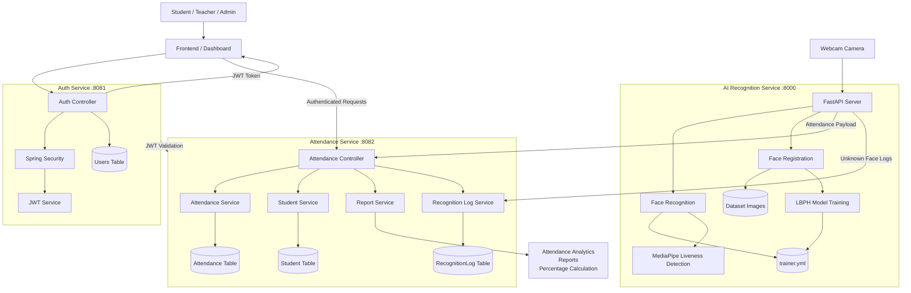

# Complete System Architecture Diagram

```mermaid id="sysarch01"
flowchart TB

    %% =========================
    %% CLIENT LAYER
    %% =========================

    USER[Student / Teacher / Admin]
    FRONTEND[Frontend / Dashboard]

    USER --> FRONTEND

    %% =========================
    %% AUTH SERVICE
    %% =========================

    subgraph AUTH_MICROSERVICE [Auth Service :8081]

        AUTH_CONTROLLER[Auth Controller]

        JWT_SERVICE[JWT Service]

        SECURITY[Spring Security]

        USER_DB[(Users Table)]

        AUTH_CONTROLLER --> SECURITY

        SECURITY --> JWT_SERVICE

        AUTH_CONTROLLER --> USER_DB

    end

    %% =========================
    %% ATTENDANCE SERVICE
    %% =========================

    subgraph ATTENDANCE_MICROSERVICE [Attendance Service :8082]

        ATT_CONTROLLER[Attendance Controller]

        ATT_SERVICE[Attendance Service]

        STUDENT_SERVICE[Student Service]

        REPORT_SERVICE[Report Service]

        LOG_SERVICE[Recognition Log Service]

        ATT_DB[(Attendance Table)]

        STUDENT_DB[(Student Table)]

        LOG_DB[(RecognitionLog Table)]

        ATT_CONTROLLER --> ATT_SERVICE

        ATT_CONTROLLER --> STUDENT_SERVICE

        ATT_CONTROLLER --> REPORT_SERVICE

        ATT_CONTROLLER --> LOG_SERVICE

        ATT_SERVICE --> ATT_DB

        STUDENT_SERVICE --> STUDENT_DB

        LOG_SERVICE --> LOG_DB

    end

    %% =========================
    %% AI SERVICE
    %% =========================

    subgraph AI_MICROSERVICE [AI Recognition Service :8000]

        FASTAPI[FastAPI Server]

        FACE_REG[Face Registration]

        FACE_REC[Face Recognition]

        LIVE[MediaPipe Liveness Detection]

        TRAIN[LBPH Model Training]

        DATASET[(Dataset Images)]

        TRAINER[(trainer.yml)]

        FASTAPI --> FACE_REC

        FASTAPI --> FACE_REG

        FACE_REG --> DATASET

        FACE_REG --> TRAIN

        TRAIN --> TRAINER

        FACE_REC --> TRAINER

        FACE_REC --> LIVE

    end

    %% =========================
    %% EXTERNAL INPUT
    %% =========================

    CAMERA[Webcam Camera]

    CAMERA --> FASTAPI

    %% =========================
    %% INTER-SERVICE COMMUNICATION
    %% =========================

    FRONTEND --> AUTH_CONTROLLER

    AUTH_CONTROLLER -->|JWT Token| FRONTEND

    FRONTEND -->|Authenticated Requests| ATT_CONTROLLER

    AUTH_MICROSERVICE -->|JWT Validation| ATTENDANCE_MICROSERVICE

    FASTAPI -->|Attendance Payload| ATT_CONTROLLER

    FASTAPI -->|Unknown Face Logs| LOG_SERVICE

    %% =========================
    %% ANALYTICS
    %% =========================

    REPORTS[Attendance Analytics<br/>Reports<br/>Percentage Calculation]

    REPORT_SERVICE --> REPORTS

```
