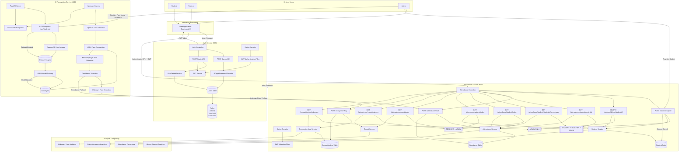

# Complete System Architecture

```mermaid id="finalarchitecture001"
flowchart TB

%% =========================================================
%% USERS / CLIENTS
%% =========================================================

subgraph USERS [System Users]

    STUDENT[Student]
    TEACHER[Teacher]
    ADMIN[Admin]

end

%% =========================================================
%% FRONTEND
%% =========================================================

subgraph FRONTEND_LAYER [Frontend / Dashboard]

    WEBAPP[Web Application / Dashboard UI]

end

STUDENT --> WEBAPP
TEACHER --> WEBAPP
ADMIN --> WEBAPP

%% =========================================================
%% AUTH SERVICE
%% =========================================================

subgraph AUTH_SERVICE [Auth Service :8081]

    AUTH_CONTROLLER[Auth Controller]

    SIGNUP_API[POST Signup API]

    SIGNIN_API[POST Signin API]

    JWT_SERVICE[JWT Service]

    JWT_FILTER[JWT Authentication Filter]

    USER_DETAILS[UserDetailsService]

    PASSWORD_ENCODER[BCrypt Password Encoder]

    SPRING_SECURITY[Spring Security]

    USERS_TABLE[(Users Table)]

    ROLE_ENUM[(Roles<br/>ADMIN<br/>TEACHER<br/>STUDENT)]

    %% FLOW

    AUTH_CONTROLLER --> SIGNUP_API

    AUTH_CONTROLLER --> SIGNIN_API

    SIGNUP_API --> PASSWORD_ENCODER

    PASSWORD_ENCODER --> USERS_TABLE

    SIGNIN_API --> USER_DETAILS

    USER_DETAILS --> USERS_TABLE

    SIGNIN_API --> JWT_SERVICE

    JWT_FILTER --> JWT_SERVICE

    SPRING_SECURITY --> JWT_FILTER

    USERS_TABLE --> ROLE_ENUM

end

%% =========================================================
%% ATTENDANCE SERVICE
%% =========================================================

subgraph ATTENDANCE_SERVICE [Attendance Service :8082]

    %% ==========================
    %% CONTROLLER LAYER
    %% ==========================

    ATT_CONTROLLER[Attendance Controller]

    %% ==========================
    %% SECURITY
    %% ==========================

    ATT_SECURITY[Spring Security]

    ATT_JWT[JWT Validation Filter]

    %% ==========================
    %% SERVICES
    %% ==========================

    ATT_SERVICE[Attendance Service]

    STUDENT_SERVICE[Student Service]

    REPORT_SERVICE[Report Service]

    LOG_SERVICE[Recognition Log Service]

    %% ==========================
    %% APIs
    %% ==========================

    REGISTER_STUDENT[POST /student/register]

    DELETE_STUDENT[DELETE /student/delete/studentId]

    MARK_ATTENDANCE[POST /attendance/mark]

    STUDENT_ATTENDANCE[GET /attendance/student/studentId]

    ATT_PERCENTAGE[GET /attendance/student/studentId/percentage]

    TODAY_ATTENDANCE[GET /attendance/student/today]

    ABSENT_STUDENTS[GET /attendance/absent/today]

    TODAY_REPORT[GET /attendance/report/today]

    BETWEEN_REPORT[GET /attendance/report/between]

    UNKNOWN_LOG[POST /recognition/log]

    UNKNOWN_FETCH[GET /recognition/log/unknown]

    %% ==========================
    %% ROLE ACCESS
    %% ==========================

    ADMIN_ACCESS[[ADMIN ONLY]]

    TEACHER_ADMIN[[TEACHER + ADMIN]]

    ALL_ACCESS[[STUDENT + TEACHER + ADMIN]]

    %% ==========================
    %% DATABASES
    %% ==========================

    STUDENT_TABLE[(Student Table)]

    ATTENDANCE_TABLE[(Attendance Table)]

    LOG_TABLE[(RecognitionLog Table)]

    %% ==========================
    %% SECURITY FLOW
    %% ==========================

    ATT_SECURITY --> ATT_JWT

    %% ==========================
    %% CONTROLLER FLOW
    %% ==========================

    ATT_CONTROLLER --> REGISTER_STUDENT

    ATT_CONTROLLER --> DELETE_STUDENT

    ATT_CONTROLLER --> MARK_ATTENDANCE

    ATT_CONTROLLER --> STUDENT_ATTENDANCE

    ATT_CONTROLLER --> ATT_PERCENTAGE

    ATT_CONTROLLER --> TODAY_ATTENDANCE

    ATT_CONTROLLER --> ABSENT_STUDENTS

    ATT_CONTROLLER --> TODAY_REPORT

    ATT_CONTROLLER --> BETWEEN_REPORT

    ATT_CONTROLLER --> UNKNOWN_LOG

    ATT_CONTROLLER --> UNKNOWN_FETCH

    %% ==========================
    %% ROLE RESTRICTIONS
    %% ==========================

    REGISTER_STUDENT --> ADMIN_ACCESS

    DELETE_STUDENT --> ADMIN_ACCESS

    UNKNOWN_FETCH --> ADMIN_ACCESS

    TODAY_REPORT --> TEACHER_ADMIN

    BETWEEN_REPORT --> TEACHER_ADMIN

    TODAY_ATTENDANCE --> TEACHER_ADMIN

    ABSENT_STUDENTS --> TEACHER_ADMIN

    STUDENT_ATTENDANCE --> ALL_ACCESS

    ATT_PERCENTAGE --> ALL_ACCESS

    %% ==========================
    %% SERVICE FLOW
    %% ==========================

    REGISTER_STUDENT --> STUDENT_SERVICE

    DELETE_STUDENT --> STUDENT_SERVICE

    MARK_ATTENDANCE --> ATT_SERVICE

    STUDENT_ATTENDANCE --> ATT_SERVICE

    ATT_PERCENTAGE --> ATT_SERVICE

    TODAY_ATTENDANCE --> ATT_SERVICE

    TODAY_REPORT --> REPORT_SERVICE

    BETWEEN_REPORT --> REPORT_SERVICE

    ABSENT_STUDENTS --> STUDENT_SERVICE

    UNKNOWN_LOG --> LOG_SERVICE

    UNKNOWN_FETCH --> LOG_SERVICE

    %% ==========================
    %% DATABASE FLOW
    %% ==========================

    STUDENT_SERVICE --> STUDENT_TABLE

    ATT_SERVICE --> ATTENDANCE_TABLE

    LOG_SERVICE --> LOG_TABLE

end

%% =========================================================
%% AI RECOGNITION SERVICE
%% =========================================================

subgraph AI_SERVICE [AI Recognition Service :8000]

    FASTAPI[FastAPI Server]

    %% ==========================
    %% FACE REGISTRATION
    %% ==========================

    REGISTER_FACE[POST /register-face/studentId]

    FACE_CAPTURE[Capture 30 Face Images]

    DATASET[(Dataset Images)]

    %% ==========================
    %% MODEL TRAINING
    %% ==========================

    TRAIN_MODEL[LBPH Model Training]

    TRAINER[(trainer.yml)]

    %% ==========================
    %% FACE RECOGNITION
    %% ==========================

    START_RECOGNITION[GET /start-recognition]

    WEBCAM[Webcam Camera]

    FACE_DETECTION[OpenCV Face Detection]

    FACE_RECOGNITION[LBPH Face Recognition]

    LIVENESS[MediaPipe Eye Blink Detection]

    CONFIDENCE[Confidence Validation]

    UNKNOWN_FACE[Unknown Face Detection]

    %% ==========================
    %% FACE REGISTRATION FLOW
    %% ==========================

    FASTAPI --> REGISTER_FACE

    REGISTER_FACE --> FACE_CAPTURE

    FACE_CAPTURE --> DATASET

    DATASET --> TRAIN_MODEL

    TRAIN_MODEL --> TRAINER

    %% ==========================
    %% RECOGNITION FLOW
    %% ==========================

    FASTAPI --> START_RECOGNITION

    WEBCAM --> FACE_DETECTION

    FACE_DETECTION --> FACE_RECOGNITION

    FACE_RECOGNITION --> TRAINER

    FACE_RECOGNITION --> LIVENESS

    LIVENESS --> CONFIDENCE

    CONFIDENCE --> UNKNOWN_FACE

end

%% =========================================================
%% AUTHENTICATION FLOW
%% =========================================================

WEBAPP -->|Login Request| AUTH_CONTROLLER

AUTH_CONTROLLER -->|JWT Token| WEBAPP

WEBAPP -->|Authenticated APIs + JWT| ATT_CONTROLLER

AUTH_SERVICE -->|JWT Validation| ATTENDANCE_SERVICE

%% =========================================================
%% STUDENT ONBOARDING FLOW
%% =========================================================

ADMIN -->|Register Student| REGISTER_STUDENT

REGISTER_STUDENT -->|Student Stored| STUDENT_TABLE

ADMIN -->|Register Face Using StudentId| REGISTER_FACE

REGISTER_FACE -->|Dataset Created| DATASET

TRAIN_MODEL -->|Model Updated| TRAINER

%% =========================================================
%% ATTENDANCE FLOW
%% =========================================================

WEBCAM --> START_RECOGNITION

CONFIDENCE -->|Attendance Payload| MARK_ATTENDANCE

MARK_ATTENDANCE --> ATTENDANCE_TABLE

%% =========================================================
%% UNKNOWN FACE FLOW
%% =========================================================

UNKNOWN_FACE -->|Unknown Face Payload| UNKNOWN_LOG

UNKNOWN_LOG --> LOG_TABLE

%% =========================================================
%% ANALYTICS
%% =========================================================

subgraph ANALYTICS [Analytics & Reporting]

    DAILY_ANALYTICS[Daily Attendance Analytics]

    ATTENDANCE_PERCENTAGE[Attendance Percentage]

    ABSENT_ANALYTICS[Absent Student Analytics]

    UNKNOWN_ANALYTICS[Unknown Face Analytics]

end

REPORT_SERVICE --> DAILY_ANALYTICS

ATT_SERVICE --> ATTENDANCE_PERCENTAGE

STUDENT_SERVICE --> ABSENT_ANALYTICS

LOG_SERVICE --> UNKNOWN_ANALYTICS

```
